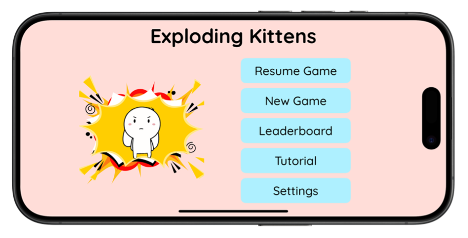
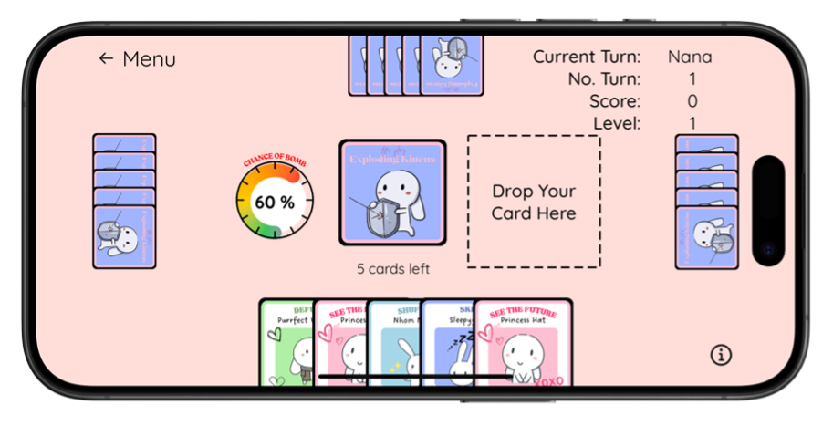
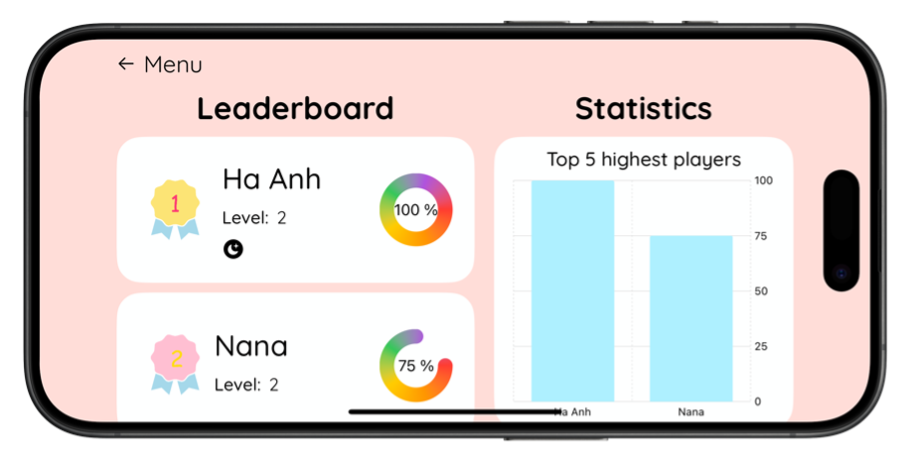
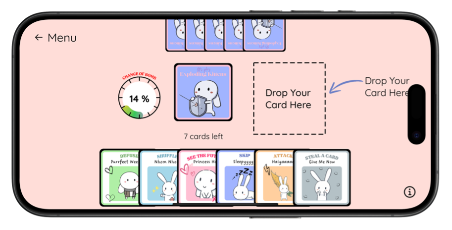
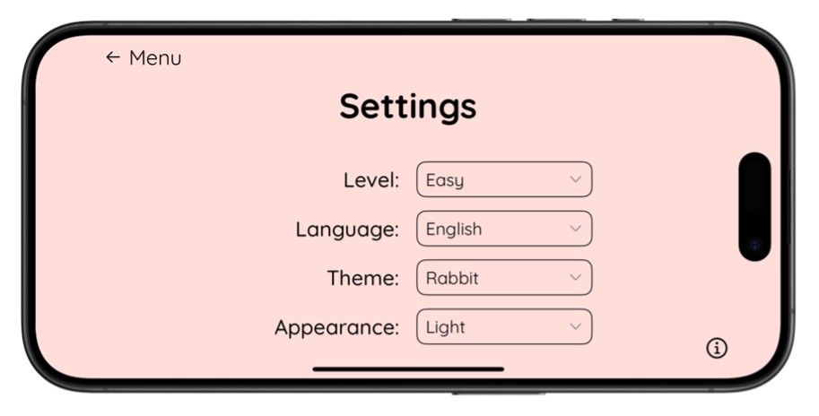
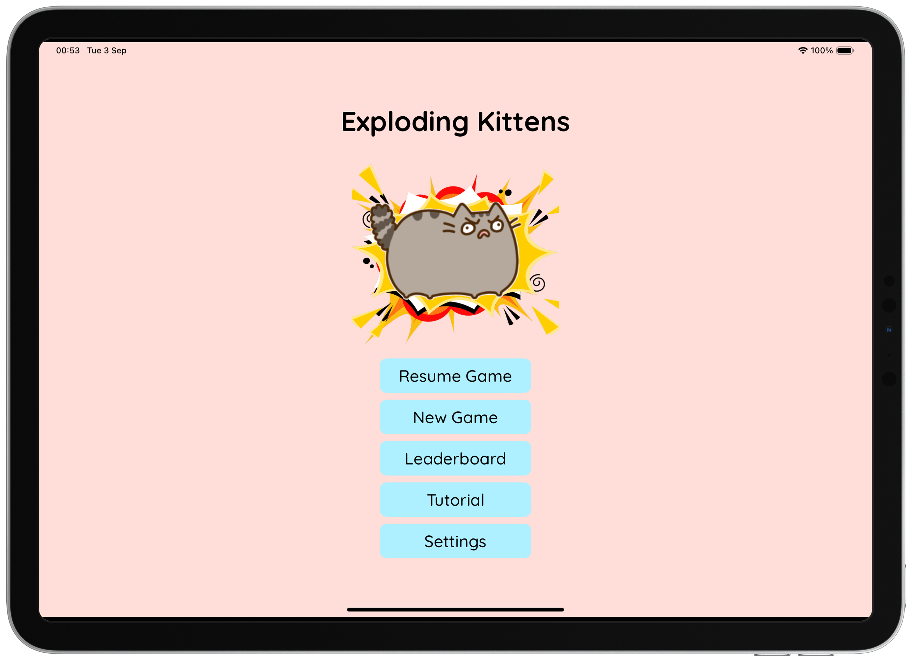

# Exploding Kittens 🎀

## 💕 Description

- This project involves the development of a digital version of the well-known card game "Exploding Kittens". 
- This game aims to provide both entertainment and strategic significance by requiring players to outsmart their adversaries by strategically playing cards to prevent "exploding" while attempting to get others to draw the explosive cards. 

   
   
   
  
  

## 💗 How To Play

- The game is played with a deck of cards, where each card has a distinct action that may either assist the player in avoiding danger or creating challenges for the opponents to overcome. 
- Each player has the ability to play any number of cards in order to avoid the bomb through their unique function of each card, and conclude their turn by retaining the card. 
- If a player receives a bomb card, they are immediately eliminated from the game unless they possess a "Defuse" card that enables them to neutralise the explosion and remain in the game. 
- The game continues until only one player remains. 

## 💖 Live Demo (Youtube Video)

<table>
  <tr>
     <td ="text-align: center; font-weight: bold;">IPhone Simulator</td>
     <td style="text-align: center; font-weight: bold;">IPhone Device</td>
  </tr>
  <tr>
    <td></td>
        <td></td>
   </tr>

 </table>
 
 <table>
  <tr>
     <td ="text-align: center; font-weight: bold;">IPad Simulator</td>
     <td style="text-align: center; font-weight: bold;">IPad Device</td>
  </tr>
  <tr>
    <td></td>
        <td></td>
   </tr>

 </table>

## 🔧 Build Information
- Xcode 15.4
- SwiftUI Framework
- Target Deployment iOS 17.5
- Library: AVFoundation, WebKit

## 🌸 Author
- Nguyen Tran Ha Anh (s3938490)
